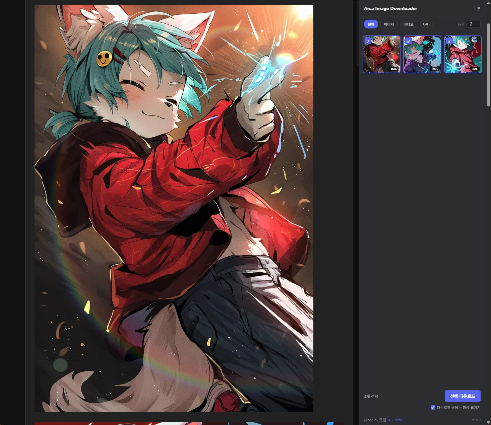
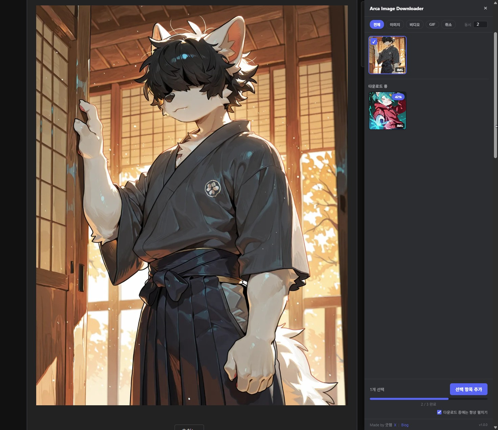

# Arca Image Downloader

아카라이브와 X(Twitter)에서 이미지, GIF, 비디오를 확인하고 선택해서 저장할 수 있는 Chrome 확장 프로그램입니다. 별도의 빌드 과정 없이 `src/`를 Chrome에 직접 로드할 수 있습니다.

<p align="center">
  
</p>

> **바로 설치:** [Chrome 웹 스토어에서 Arca Downloader 설치하기](https://chromewebstore.google.com/detail/arca-downloader-x-%ED%8A%B8%EC%9C%84%ED%84%B0-%EC%9D%B4%EB%AF%B8%EC%A7%80/boeehnfmkbjiekeconbmobbdgeidgmmj?hl=ko)

## 주요 기능

- 게시글이나 트윗에 포함된 미디어 자동 탐색
- 여러 이미지 일괄 다운로드와 항목별 선택
- 이미지, GIF, 비디오 미리보기와 필터
- 다운로드 중 항목 추가, 진행률 표시, 취소
- 실패 항목 재시도와 실패 이력 확인
- 이미 받은 파일 확인과 중복 다운로드 방지
- 사이트별 폴더 생성 옵션
- 아카라이브 이모티콘 자동 제외
- X/Twitter 트윗 액션 바와 미디어 뷰어의 인라인 다운로드 버튼

## 사용 화면

| 여러 미디어 선택 및 일괄 다운로드 | 다운로드 중 선택 항목 추가 |
| :---: | :---: |
|  |  |

## 지원 사이트

- `https://arca.live/*`
- `https://x.com/*`
- `https://twitter.com/*`

지원 미디어는 이미지, GIF, 비디오입니다. X/Twitter 동영상은 페이지에 노출된 직접 URL을 우선 사용하며, 필요한 경우 현재 페이지 세션 또는 백그라운드의 guest GraphQL 요청으로 다운로드 가능한 MP4를 확인합니다.

## 소스에서 설치

1. 이 저장소를 내려받거나 복제합니다.
2. Chrome에서 `chrome://extensions`를 엽니다.
3. 우측 상단의 `개발자 모드`를 켭니다.
4. `압축해제된 확장 프로그램을 로드합니다`를 누릅니다.
5. 저장소 루트가 아니라 `src/` 폴더를 선택합니다.

`manifest.json`은 `src/` 바로 아래에 있습니다.

## 사용 방법

### 아카라이브

1. 게시글 페이지를 엽니다.
2. 페이지의 `DL` 버튼으로 미디어 선택 화면을 엽니다.
3. 이미지, GIF, 비디오 중 받을 항목을 선택합니다.
4. 다운로드를 시작하고 우측 하단 현황에서 진행 상태를 확인합니다.

### X(Twitter)

1. 트윗 또는 미디어 상세 화면을 엽니다.
2. 트윗 액션 바의 다운로드 버튼을 누릅니다.
3. 트윗에 포함된 이미지, GIF, 비디오가 다운로드 대기열에 추가됩니다.
4. 우측 하단 현황에서 진행 상태와 실패 항목을 확인합니다.

## 저장 및 다운로드 동작

- 아카라이브는 기본적으로 두 파일을 동시에 다운로드합니다.
- X/Twitter는 안정성을 위해 한 번에 한 파일을 처리하고 항목 사이에 지연을 둡니다.
- 폴더 생성 옵션을 켜면 게시글 제목 또는 X 계정 이름 기준으로 정리합니다.
- 다운로드 중 새 항목을 추가해도 기존 대기열과 중복되는 파일은 다시 넣지 않습니다.
- 브라우저 다운로드 기록에서 동일한 파일을 확인하면 선택 화면에 이미 받은 항목으로 표시합니다.

## 권한 안내

- `downloads`: 다운로드 시작, 진행 상태 확인, 중복 파일 확인
- `storage`: 사용자 옵션, 다운로드 상태, 실패 이력 저장
- `alarms`: 재시도 대기 중인 다운로드를 다시 깨우기 위한 예약
- `arca.live`, `*.namu.la`: 아카라이브 페이지 분석과 원본 미디어 다운로드
- `x.com`, `twitter.com`: 트윗 미디어 탐색과 페이지 세션을 이용한 정보 확인
- `api.twitter.com`, `abs.twimg.com`: X/Twitter 비디오의 guest token, GraphQL 메타데이터, 웹 번들 정보 확인
- `gist.githubusercontent.com`, `raw.githubusercontent.com`: 개발자가 원격 사이트 규칙 주소를 설정한 경우 JSON 규칙 확인

확장 프로그램은 사용자의 미디어나 게시글 내용을 별도 운영 서버에 업로드하지 않습니다. 자세한 내용은 [개인정보 처리방침](PRIVACY_POLICY.md)을 참고하세요.

## 저장소 구조

```text
src/                 Chrome에 로드하고 배포 ZIP에 포함하는 런타임
img/                 README에 사용하는 소개 및 동작 화면
tools/               정적 검사, 합성 테스트, 패키징 도구
docs/                아키텍처, 사이트 설정, 배포 문서
.agents/skills/      프로젝트 작업용 Codex 스킬
.github/workflows/   GitHub Actions 검증
```

핵심 런타임 파일:

- `src/manifest.json`
- `src/content/content.js`
- `src/content/twitter-resolver.js`
- `src/content/content-ui.js`
- `src/background/twitter-api.js`
- `src/background/background.js`
- `src/shared/media-utils.js`

## 검증

Node.js 22 이상에서 외부 패키지 설치 없이 실행할 수 있습니다.

```powershell
node tools/test-validate-extension.js
node tools/test-media-utils.js
node tools/test-twitter-api.js
node tools/validate-extension.js
```

테스트에는 실제 게시물 HTML, 쿠키, 토큰을 사용하지 않습니다.

## 배포 ZIP 만들기

PowerShell 7에서 실행합니다.

```powershell
pwsh -File tools/package-extension.ps1
```

결과는 `dist/arca-image-downloader-v<버전>.zip`에 생성됩니다. ZIP 루트에는 `manifest.json`이 위치하며 저장소 문서와 개발 도구는 포함되지 않습니다.

## 개인정보 처리방침

[PRIVACY_POLICY.md](PRIVACY_POLICY.md)에서 처리 정보, 권한 목적, 저장과 전송 방식을 확인할 수 있습니다.

## 라이선스

[MIT License](LICENSE)

## 문의

- X: [https://x.com/daryeou](https://x.com/daryeou)
- Blog: [https://daryeou.tistory.com](https://daryeou.tistory.com)
